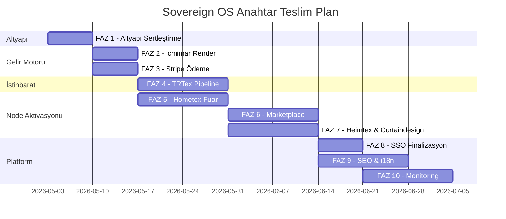

# AIPyram Sovereign OS — Anahtar Teslim Gemini Execution Plan

> **Amaç**: Tüm ekosistemi anahtar teslim production-ready hale getirmek.
> **Hedef**: Gemini bu dokümanı faz faz okuyup kodlayacak.
> **Kural**: Her faz sonunda `pnpm run build` → 0 HATA + `git commit` ZORUNLU.

---

## 📊 MEVCUT DURUM — EKOSİSTEM RÖNTGEN

### Çalışan Altyapı ✅
| Bileşen | Durum | Dosya |
|---------|:-----:|-------|
| Multi-tenant routing | ✅ | `middleware.ts` — 11 domain yönlendirme |
| Sovereign Config (SSoT) | ✅ | `sovereign-config.ts` — 11 node tanımlı |
| AI Client (singleton) | ✅ | `aiClient.ts` — rate limit + budget |
| Agent Bus (A2A) | ✅ | `agentBus.ts` — Genkit Flow, audit log |
| Sovereign Authority | ✅ | `sovereignAuthority.ts` — action-level control |
| Render Budget Guard | ✅ | `renderBudgetGuard.ts` — cost control |
| executeTask (tek kapı) | ✅ | `aiClient.ts` — bypass engelleme |
| Cost Guard | ✅ | `costGuard.ts` — loop + budget + pattern |
| Tool Permissions | ✅ | `toolPermissions.ts` — 3 seviye güvenlik |
| Firebase Auth (SSO) | ✅ | `AipyramAuthProvider.tsx` + session API |
| Build Stability | ✅ | 0 hata, 49 sayfa, 36 API route |

### Kritik Eksikler 🔴
| # | Eksik | Etki | Öncelik |
|---|-------|------|:-------:|
| 1 | Firestore Composite Index'ler | TRTex haber sıralaması yavaş | 🔴 |
| 2 | icmimar render backend kapalı | Gelir motoru çalışmıyor | 🔴 |
| 3 | Ödeme sistemi (Stripe) pasif | Kredi satışı yok | 🔴 |
| 4 | Cron pipeline'lar durdurulmuş | Otonom içerik üretimi yok | 🔴 |
| 5 | Heimtex.ai sadece statik UI | Trend verisi yok | 🟡 |
| 6 | Curtaindesign.ai ürün verisi yok | B2C mağaza boş | 🟡 |
| 7 | Hometex.ai fuar verisi mock | Gerçek exhibitor yok | 🟡 |
| 8 | Perde.ai marketplace ürünsüz | Seller pipeline eksik | 🟡 |
| 9 | Vorhang.ai marketplace ürünsüz | DACH pazarı boş | 🟡 |
| 10 | SEO: sitemap dinamik değil | Google indexleme zayıf | 🟡 |
| 11 | i18n: Node sayfaları çevrilmemiş | Sadece AIPyram.com 8 dilli | 🟢 |
| 12 | Mobile responsive eksikleri | Bazı bileşenler taşıyor | 🟢 |
| 13 | Analytics/monitoring yok | Kullanım görünürlüğü sıfır | 🟢 |

---

## FAZ 1: Altyapı Sertleştirme (1 Hafta)

> **Amaç**: Google API açılınca ilk yapılacaklar. Firestore + Cron güvenli aktivasyon.

### 1.1 Firestore Composite Index'ler
Firebase Console'dan oluşturulacak index'ler:

```
// trtex_news: status + createdAt sıralaması
Collection: trtex_news
Fields: status ASC, createdAt DESC

// aloha_agent_bus: status + createdAt  
Collection: aloha_agent_bus
Fields: status ASC, createdAt DESC

// sovereign_audit_log: nodeId + timestamp
Collection: sovereign_audit_log
Fields: nodeId ASC, timestamp DESC

// icmimar_render_log: userId + timestamp
Collection: icmimar_render_log  
Fields: userId ASC, timestamp DESC

// aloha_costs: node + timestamp
Collection: aloha_costs
Fields: node ASC, timestamp DESC
```

### 1.2 Kill Switch Firestore Dokümanları
```
// aloha_system_state/global
{
  lockdown: false,
  global_kill_switch: false,
  reason: "",
  lastUpdated: ""
}

// aloha_system_state/finance
{
  global_kill_switch: false,
  monthly_budget_usd: 20,
  reason: ""
}

// sovereign_agent_authority/icmimar
{
  renderEnabled: true,
  dailyRenderBudget: 10,
  dailyCostLimitUSD: 2.0,
  allowedActions: ["image_generation", "text_generation", "embedding", "data_write"]
}
```

### 1.3 Cron Pipeline Güvenli Yeniden Başlatma
**Dosya**: `src/app/api/cron/master-cycle/route.ts`

Değişiklik:
```typescript
// 1. executeTask() üzerinden çalışması sağlanacak
import { executeTask } from '@/core/aloha/aiClient';

// 2. Her cron tetiklemesi önce authority check yapacak
const auth = await executeTask({
  nodeId: 'trtex',
  action: 'news_pipeline',
  payload: { task: 'master_cycle' },
  caller: 'cron_master_cycle'
});

if (!auth.success) {
  return NextResponse.json({ blocked: true, reason: auth.error });
}
```

**Aynı pattern şu cron'lara da uygulanacak:**
- `cron/image-processor`
- `cron/scan-images`
- `cron/ticker-refresh`
- `cron/tender-cycle`
- `cron/market-data`
- `cron/gti-cycle`
- `cron/translation-processor`
- `cron/academy-cycle`

### 1.4 Doğrulama
- [ ] `pnpm run build` → 0 hata
- [ ] Firestore Console'da index'ler oluşturuldu
- [ ] `sovereign_agent_authority/icmimar` dokümanı yazıldı
- [ ] Cron endpoint'leri authority check yapıyor

---

## FAZ 2: icmimar.ai Render Motor Aktivasyonu (1 Hafta)

> **Amaç**: Gelir modelinin çekirdeği. Image-to-Image tasarım motorunu canlıya almak.

### 2.1 RoomVisualizer → Backend Bağlantısı
**Dosya**: `src/components/node-icmimar/RoomVisualizer.tsx` (66KB)

Değişiklik:
```typescript
// Mevcut: Frontend-only, render çağrısı yok
// Yeni: /api/icmimar/render endpoint'ine POST

async function handleRender(prompt: string, renderType: RenderType) {
  const res = await fetch('/api/icmimar/render', {
    method: 'POST',
    headers: { 'Content-Type': 'application/json' },
    body: JSON.stringify({
      prompt,
      userId: user.uid,
      userEmail: user.email,
      renderType,  // curtain | wall | sofa | full_room
      style: selectedStyle,
      aspectRatio: '16:9',
      referenceImageUrl: uploadedImageUrl,
    }),
  });
  const data = await res.json();
  if (data.success) {
    setRenderedImage(data.imageUrl);
    setCreditsRemaining(data.creditsRemaining);
  }
}
```

### 2.2 Perde.ai RoomVisualizer Senkronizasyonu
**Dosya**: `src/components/node-perde/RoomVisualizer.tsx` (62KB)

Aynı render backend bağlantısı — `nodeId: 'perde'` ile. Perde.ai render yetkisi şimdilik kapalı (`renderEnabled: false`), ileride Firestore override ile açılabilir.

### 2.3 Kredi Satın Alma Sayfası
**Dosya**: `src/app/sites/[domain]/pricing/page.tsx` [GÜNCELLENMİŞ]

Mevcut: Statik fiyat bilgisi. Yeni: Stripe Checkout bağlantısı ile gerçek satış.

### 2.4 Doğrulama
- [ ] icmimar.ai'de render butonu çalışıyor
- [ ] Render sonucu Storage'a yazılıyor
- [ ] Kredi düşüşü yapılıyor
- [ ] Sovereign Bypass çalışıyor (hakantoprak71@gmail.com)

---

## FAZ 3: Ödeme Sistemi — Stripe Aktivasyonu (1 Hafta)

> **Amaç**: Kredi satışı ile gelir üretmeye başlamak.

### 3.1 Stripe Checkout Akışı
**Mevcut dosya**: `src/services/stripeService.ts` — env var okuma mevcut ama fonksiyonlar boş.

**Yeni dosyalar:**
- `src/app/api/stripe/checkout/route.ts` → Checkout Session oluşturma
- `src/app/api/stripe/webhook/route.ts` → Ödeme tamamlandığında Firestore `sovereign_users/{uid}.unifiedCredits` güncelleme

### 3.2 Kredi Paketleri (sovereign_users)
```typescript
const CREDIT_PACKAGES = [
  { id: 'starter',  credits: 10,   priceUSD: 9.99,  label: 'Starter' },
  { id: 'pro',      credits: 50,   priceUSD: 39.99, label: 'Professional' },
  { id: 'business', credits: 200,  priceUSD: 129.99, label: 'Business' },
  { id: 'unlimited', credits: 999, priceUSD: 299.99, label: 'Enterprise' },
];
```

### 3.3 Pricing UI Bileşeni
**Dosya**: `src/components/node-icmimar/Pricing.tsx` (10KB mevcut)

Statik kartları Stripe Checkout butonu ile bağla.

### 3.4 Doğrulama
- [ ] Stripe test modunda Checkout akışı çalışıyor
- [ ] Webhook kredi ekleme yapıyor
- [ ] `sovereign_users/{uid}.unifiedCredits` güncelleniyor

---

## FAZ 4: TRTex Otonom İstihbarat Pipeline (2 Hafta)

> **Amaç**: TRTex'in ana değer teklifi: Otonom haber + pazar istihbaratı.

### 4.1 News Pipeline Yeniden Aktivasyon
**Dosyalar:**
- `src/core/aloha/newsEngine.ts` (31KB)
- `src/core/aloha/live-news-swarm.ts` (26KB)
- `src/core/aloha/tradePipeline.ts` (13KB)

Değişiklik: Tüm `alohaAI.generate()` çağrılarını `executeTask()` üzerinden geçir.

### 4.2 Ticker Data Akışı
**Dosya**: `src/core/aloha/tickerDataFetcher.ts` (10KB)

Gerçek piyasa verileri (pamuk, polyester, navlun) → IntelligenceTicker bileşenine.

### 4.3 Lead Engine Aktivasyonu
**Dosyalar:**
- `src/core/aloha/leadEngine.ts` (14KB)
- `src/core/aloha/lead-engine/` dizini

Alıcı-Tedarikçi eşleştirme motorunu canlıya al.

### 4.4 Article Image Pipeline
**Dosya**: `src/core/aloha/imageAgent.ts` (24KB)

`processMultipleImages()` → `executeTask({ nodeId: 'trtex', action: 'image_generation' })` üzerinden çalışacak. TRTex için render yetkisi Firestore override ile açılacak.

### 4.5 Doğrulama
- [ ] `/api/cron/master-cycle` çalışıyor
- [ ] Yeni haber Firestore'a yazılıyor
- [ ] Ticker verileri güncelleniyor
- [ ] Lead eşleştirme çalışıyor

---

## FAZ 5: Hometex.ai Sanal Fuar Aktivasyonu (2 Hafta)

> **Amaç**: 365 gün açık B2B sanal fuarı gerçek verilerle doldurmak.

### 5.1 Exhibitor Veri Modeli
**Firestore Koleksiyon**: `hometex_exhibitors`
```typescript
interface Exhibitor {
  id: string;
  companyName: string;
  boothNumber: string;
  country: string;
  categories: string[];   // perde, döşeme, yatak, aksesuar
  logo: string;
  description: string;
  productImages: string[];
  contactEmail: string;
  website: string;
  verified: boolean;
}
```

### 5.2 Exhibitor Onboarding Formu
**Yeni dosya**: `src/components/node-hometex/ExhibitorOnboarding.tsx`

Self-servis stant kaydı. Firestore'a yazar.

### 5.3 3D Showroom Placeholder → Gerçek Ürün Grid
**Dosya**: `src/components/node-hometex/Expo.tsx` (11KB)

Mock veriyi Firestore `hometex_exhibitors` okuyacak şekilde değiştir.

### 5.4 Fair Calendar → Gerçek Fuar Verileri
**Dosya**: `src/app/sites/[domain]/fairs/page.tsx`

Statik listeyi Firestore `hometex_fairs` koleksiyonundan okuyacak şekilde değiştir.

### 5.5 Doğrulama
- [ ] Exhibitor kayıt formu çalışıyor
- [ ] Expo sayfası gerçek exhibitor'ları gösteriyor
- [ ] Fuar takvimi dinamik

---

## FAZ 6: Perde.ai & Vorhang.ai B2C Marketplace (2 Hafta)

> **Amaç**: icmimar.ai'de üretilen tasarımların son tüketiciye satıldığı vitrin.

### 6.1 Seller Pipeline (icmimar → Perde.ai)
**Dosyalar:**
- `src/components/node-vorhang/SellerOnboarding.tsx` (11KB — mevcut)
- `src/components/node-vorhang/SellerDashboard.tsx` (5KB — mevcut)
- `src/components/node-vorhang/SellerIngestion.tsx` (7KB — mevcut)

Bu bileşenler UI olarak hazır ama backend bağlantısı yok. Firestore koleksiyonlarına bağla:
- `perde_products` / `vorhang_products`
- `perde_orders` / `vorhang_orders`
- `perde_sellers` / `vorhang_sellers`

### 6.2 Checkout Akışı
**Dosya**: `src/components/node-vorhang/CheckoutPage.tsx` (10KB)

Stripe Connect ile seller'a ödeme yönlendirme.

### 6.3 Marketplace Product Ingestion
icmimar.ai'de oluşturulan tasarımları otomatik olarak Perde.ai/Vorhang.ai marketplace'e yayınla.

### 6.4 Doğrulama
- [ ] Seller kayıt → ürün listeme → satış akışı çalışıyor
- [ ] Checkout → ödeme → sipariş oluşturma
- [ ] icmimar → marketplace ürün senkronizasyonu

---

## FAZ 7: Heimtex.ai & Curtaindesign.ai İçerik Motoru (2 Hafta)

> **Amaç**: İçerik boşlukları doldurularak marka otoritesi oluşturma.

### 7.1 Heimtex.ai Trend Verisi
**Dosyalar:**
- `src/components/node-heimtex/HeimtexTrends.tsx` (4KB)
- `src/components/node-heimtex/HeimtexMagazine.tsx` (3KB)

Mevcut: Boş grid gösteriyor ("Future Trends Are Being Processed...").
Yeni: `heimtex_trends` ve `heimtex_articles` Firestore koleksiyonlarından oku.

Otonom pipeline: TRTex newsEngine benzeri bir `heimtex_trend_pipeline` — Pantone renk kodları, doku trendleri, moda vizyonu.

### 7.2 Curtaindesign.ai Ürün Kataloğu
**Dosya**: `src/components/node-curtaindesign/CurtaindesignLandingPage.tsx` (6KB)

Mevcut: "Collections are being curated by our AI engine" placeholder.
Yeni: `curtaindesign_products` Firestore koleksiyonundan gerçek ürünler.

### 7.3 Heimtex Dictionary Genişletme
**Dosya**: `src/components/node-heimtex/heimtex-dictionary.ts` (592 bytes — neredeyse boş)

İngilizce + Almanca + Türkçe tam çeviri sözlüğü gerekiyor.

### 7.4 Doğrulama
- [ ] Heimtex.ai trend kartları gerçek veri gösteriyor
- [ ] Curtaindesign.ai ürün grid'i doldu
- [ ] Dictionary tam dolu

---

## FAZ 8: Sovereign SSO Finalizasyonu (1 Hafta)

> **Amaç**: Tek hesap, tüm ekosistem — Google hesabı gibi.

### 8.1 Cross-Node Login Test
Tüm 11 node'da login → session → profile akışını doğrula:
- Firebase Auth → `/api/auth/session` → HttpOnly cookie
- `sovereign_users/{uid}` → Sovereign Passport

### 8.2 Unified Wallet UI
**Dosya**: `src/app/sites/[domain]/profile/page.tsx`

Her node'da kullanıcının:
- Kalan kredi bakiyesi
- Node bazlı harcama geçmişi
- Tier durumu (Free → Bronze → Silver → Gold → Platinum)

### 8.3 Tier Upgrade Otomasyonu
Stripe webhook'tan gelen ödeme sonrası otomatik tier yükseltme:
```typescript
if (totalSpend >= 100) tier = 'silver';
if (totalSpend >= 500) tier = 'gold';
if (totalSpend >= 2000) tier = 'platinum';
```

### 8.4 Doğrulama
- [ ] icmimar.ai'de login → Perde.ai'ye geçiş → oturum korunuyor
- [ ] Wallet tüm node'larda aynı bakiyeyi gösteriyor
- [ ] Tier yükseltme çalışıyor

---

## FAZ 9: SEO & i18n Finalizasyonu (2 Hafta)

> **Amaç**: Google indexleme ve çok dilli erişim.

### 9.1 Dinamik Sitemap
**Dosya**: `src/app/api/sitemap/route.ts` (mevcut ama statik)

Yeni: Firestore'dan tüm haberleri, ürünleri, fuar sayfalarını çekip XML sitemap oluştur.

```xml
<url>
  <loc>https://trtex.com/news/{slug}</loc>
  <lastmod>{updatedAt}</lastmod>
  <changefreq>daily</changefreq>
</url>
```

### 9.2 Node-Spesifik i18n
**Mevcut**: AIPyram.com → 8 dil (`messages/*.json`)
**Eksik**: Node sayfaları kendi dictionary'lerini kullanıyor, çoğu eksik.

| Node | Dictionary | Durum |
|------|-----------|:-----:|
| icmimar.ai | `icmimar-dictionary.ts` (52KB) | ✅ Tam |
| perde.ai | `perde-dictionary.ts` (52KB) | ✅ Tam |
| heimtex.ai | `heimtex-dictionary.ts` (592B) | 🔴 Boş |
| vorhang.ai | Inline Almanca | 🟡 Kısmi |
| hometex.ai | Inline İngilizce | 🟡 Kısmi |
| curtaindesign.ai | Inline İngilizce | 🟡 Kısmi |
| trtex.com | Inline 3 dil | 🟡 Kısmi |

**Aksiyon**: Heimtex, Vorhang, Hometex, Curtaindesign, TRTex için tam dictionary dosyaları oluştur (TR + EN + DE + target locale).

### 9.3 Structured Data (JSON-LD)
Her sayfa tipine uygun JSON-LD ekle:
- `NewsArticle` → haber sayfaları
- `Product` → ürün sayfaları
- `Organization` → kurumsal sayfalar
- `Event` → fuar sayfaları

### 9.4 Doğrulama
- [ ] Google Search Console sitemap kabul ediyor
- [ ] Her node'un dictionary'si dolu
- [ ] JSON-LD doğrulama aracından geçiyor

---

## FAZ 10: Monitoring, Analytics & Admin Dashboard (2 Hafta)

> **Amaç**: Kurucunun tek ekrandan tüm sistemi görmesi.

### 10.1 Unified Dashboard Güçlendirme
**Dosya**: `src/app/sites/aipyram/unified-dashboard/page.tsx`

Mevcut: Temel overview. Yeni:
- **Sovereign Authority raporu** (node bazlı kullanım, maliyet, kalan bütçe)
- **Audit log viewer** (`sovereign_audit_log` son 100 kayıt)
- **Node sağlık durumu** (her node'un son hata, son başarılı çağrı)
- **Kill Switch toggle** (tek butonla LOCKDOWN)

### 10.2 Google Analytics Entegrasyonu
**Dosya**: `src/components/GoogleAnalytics.tsx` (2.6KB — mevcut)

Her node için ayrı GA4 stream ID:
```typescript
const GA_STREAMS: Record<string, string> = {
  trtex: 'G-TRTEX...',
  icmimar: 'G-ICMIMAR...',
  perde: 'G-PERDE...',
  // ...
};
```

### 10.3 Uptime + Error Monitoring
`/api/health-full` endpoint'ini genişlet:
- Firestore bağlantısı
- Storage erişimi
- Gemini API durumu
- Son cron çalışma zamanı
- Kill switch durumu

### 10.4 Doğrulama
- [ ] Dashboard tüm node'ları gösteriyor
- [ ] Kill Switch butonu çalışıyor
- [ ] Health check tüm servisleri kontrol ediyor

---

## ZAMAN ÇİZELGESİ



## HAKAN BEY'İN 6 KURALI — HER FAZDA GEÇERLİ

> [!CAUTION]
> Bu 6 kural her faz'da, her dosyada, her commit'te zorunludur:

| # | Kural | Kontrol |
|---|-------|---------|
| 1 | **TEK GİRİŞ NOKTASI** — `executeTask()` | Hiçbir dosya doğrudan `alohaAI.generate()` çağırmayacak |
| 2 | **ACTION-LEVEL CONTROL** | Her node sadece izin verilen aksiyonları yapacak |
| 3 | **COST CONTROL ($)** | Adet değil, maliyet kontrolü. `dailyCostLimitUSD` |
| 4 | **KILL SWITCH** | `aloha_system_state/global` → tek tuşla dur |
| 5 | **AUDIT LOG** | Her ajan iletişimi kayıt altında |
| 6 | **RENDER TİPİ** | curtain/wall/sofa/full_room — ileride fiyat + sipariş |

---

## TOPLAM İŞ HACMİ

| Metrik | Sayı |
|--------|------|
| Toplam Faz | 10 |
| Yeni Dosya | ~25 |
| Güncellenen Dosya | ~45 |
| Yeni Firestore Koleksiyon | ~12 |
| Yeni API Route | ~8 |
| Tahmini Süre | 14-16 hafta |
| Öncelik Sırası | FAZ 1-3 (gelir) → FAZ 4-7 (içerik) → FAZ 8-10 (platform) |
